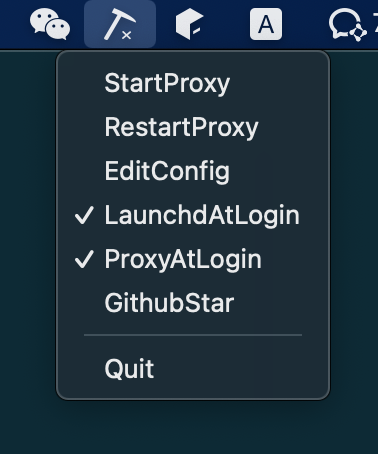
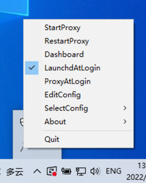

## SingBoxClient

Client for [sing-box](https://github.com/SagerNet/sing-box), support macos/win/linux, [download](https://github.com/daodao97/SingBox/releases)

<table>
  <tr>
    <td></td>
    <td></td>
  </tr>
</table> 

## Usage

1. Click System Tray Icon > EditConfig
2. Start/Stop Proxy

## Extend sing-box config

> Please note that this is not an official capability of [sing-box](https://github.com/SagerNet/sing-box)

<details>
<summary>Proxy Provider</summary>

```json
{
  "outbounds": [
    {
      "type": "provider",
      "tag": "my_provider",
      "provider_type": "url",
      "url": "url1" // ['url1', 'url2'] just v2ray sub link
    },
    {
      "type": "provider",
      "tag": "my_provider",
      "provider_type": "file",
      "file": "file_path" // ['file_path1'] 
    }
  ]
}
```
provider file format like [sing-box/outbound](https://sing-box.sagernet.org/configuration/outbound/)

  ```json
  [
      {
        "type": "ss",
        "tag": "ss"
      },
      ...
  ]
  ```

</details>

## Tips

on macos, please install terminal-notifier

```shell
brew install terminal-notifier
```
